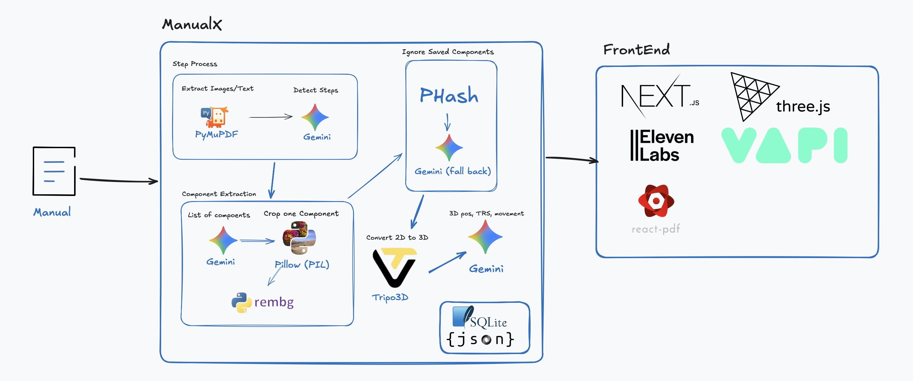

# ManualY

Transform PDF manuals into interactive 3D piece-based assembly guides using AI.

## Inspiration

We've all been there  staring at a cryptic assembly manual, trying to figure
out which screw goes where. IKEA furniture, BBQ grills, electronics, even Lego
sets. The instructions feel like they're working against you. Tiny 2D
diagrams. Ambiguous arrows. Part numbers that mean nothing. One mistake, and
you're disassembling everything to start over.

We asked ourselves: **What if understanding was guaranteed?** What if you
could see every step in an interactive 3D model, hear clear voice guidance,
and ask questions when you're stuck? That's the experience we set out to
build.

## Features

- Piece-based 3D visualization
- Step-by-step assembly instructions
- AI-powered component detection and matching
- Hybrid component comparison (PHash + Gemini Vision fallback)
- Background removal with rembg
- 3D model generation with Tripo3D
- Voice interaction with VAPI and ElevenLabs
- Interactive 3D viewer with Three.js
- Barcode-to-manual: scan a product's barcode and let the Tinyfish web agent locate the PDF

## Environment variables

**Backend (`backend/.env`)**

- `TINYFISH_API_KEY` — required for `POST /barcode`. The endpoint asks the Tinyfish web agent to find the official user manual PDF for a given UPC/EAN and then feeds it into the existing upload+process pipeline.
- `TINYFISH_API_URL` — optional override (defaults to `https://api.tinyfish.ai/v1/agents/run`).

**Frontend (`frontend/.env.local`)**

- `NEXT_PUBLIC_API_URL` — FastAPI base URL (defaults to `http://localhost:8000`).
- `NEXT_PUBLIC_DEMO_MODE` — set to `false` to hit the real backend. Omit or set to any other value to run the offline demo (bundled static manuals; barcode scanner uses a small mock mapping).

## Architecture

### Backend (ManualY)

**Step Process:**
- PyMuPDF - Extract images/text from PDF manuals
- Gemini - Detect assembly steps

**Component Extraction:**
- Gemini - List components from steps
- Pillow (PIL) - Crop individual components
- rembg - Remove background from component images

**Component Matching:**
- PHash - Ignore previously saved components
- Gemini (fallback) - Vision-based component matching

**3D Generation:**
- Tripo3D - Convert 2D component images to 3D models
- Gemini - Generate 3D positioning, transforms, and movement data

**Storage:**
- SQLite + JSON

### Frontend (Next.js)

- Next.js - React framework
- Three.js - 3D rendering
- react-pdf - PDF viewing
- ElevenLabs - Voice narration
- VAPI - Voice interaction
