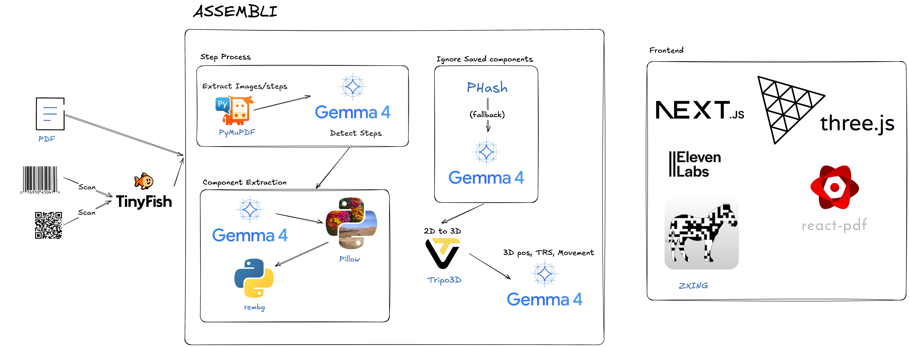

# Assembli



**Scan a barcode, build in 3D, assembly manuals you can actually follow.**

Assembli turns any product manual PDF into a fully interactive 3D assembly guide with real 3D models, step-by-step voice narration, and a conversational voice agent that can answer questions and jump to any step on command.

## Inspiration

We've all been there, staring at a cryptic assembly manual, trying to figure out which screw goes where. IKEA furniture, BBQ grills, electronics, even Lego sets. Tiny 2D diagrams. Ambiguous arrows. Part numbers that mean nothing. One mistake and you're disassembling everything to start over.

We asked: **what if understanding was guaranteed?** Point your phone at a barcode, see every part in 3D, hear the instructions spoken to you, and ask questions when you're stuck. No more squinting at diagrams.

## What it does

1. **Scan or upload.** Point your camera at a product's barcode (UPC or IKEA article number), or drag in a PDF manual directly.
2. **Find the manual.** A Tinyfish web agent searches the internet in real time for the official manufacturer PDF — you watch its live browser stream as it works.
3. **Understand it with AI.** The backend pipeline extracts steps and components, removes image backgrounds, matches parts against a reusable library, generates real 3D models with Tripo3D, and figures out how each piece should be positioned and moved.
4. **Build in 3D.** An interactive Three.js workspace shows each step with highlighted moving parts, a synced PDF viewer, step navigation, and auto-played ElevenLabs narration.
5. **Ask anything.** Hold the space bar and talk to the voice agent — it can answer questions and jump to any step you ask about.

## Features

### PDF → 3D pipeline

- **PDF extraction** — PyMuPDF pulls every image and text block from the manual.
- **Step detection** — A Gemma vision model groups images, text, and page regions into discrete assembly steps with voice-friendly descriptions.
- **Component detection** — Each step is re-analyzed to locate every distinct part, with bounding boxes, quantities, and colors.
- **Background removal** — rembg cleans every cropped component image to a transparent PNG.
- **Smart component matching** — New components are compared against the library first by perceptual hash (pHash, fast) and then by Gemma vision (fallback), so the same screw across 14 steps becomes one reusable model.
- **3D generation** — Tripo3D converts each unique 2D component into a textured, PBR-lit GLB.
- **Step analysis** — Gemma computes 3D positions, rotations, scales, movement paths, and camera angles for every component in every step.
- **Narration** — ElevenLabs generates an MP3 narration for each step.

### Barcode-to-manual

- Camera-based scanning via `@zxing/browser` (UPC-A/E, EAN-13/8, Code 128/39, ITF, Codabar, QR).
- Manual text-entry fallback.
- Auto-detects UPC vs. IKEA article-number format and dispatches the correct Tinyfish agent goal.
- Server-Sent Events stream live agent progress to the UI — you see the actual browser view as the agent searches.

### Interactive 3D workspace

- React Three Fiber scene with `OrbitControls`, contact shadows, HDRI environment lighting, and dynamic camera fitting per step.
- Moving components highlight and animate along their `from → to` trajectory.
- Axis gizmo, per-step zoom, and step replay/mute controls.
- Right-side panel toggles between the original PDF (auto-scrolled to the page/region of the current step) and a list of all steps.

### Voice agent

- Press-and-hold space bar activates the Web Speech API for STT.
- Transcripts are sent to a Gemini 2.5 Flash endpoint with the full step context and a `goto_step` function tool.
- Gemini can reply conversationally _or_ navigate the UI — if it calls `goto_step`, the workspace jumps to that step and auto-narrates it.
- Step narration is automatically muted while the agent is listening/speaking.

### Demo mode

- `NEXT_PUBLIC_DEMO_MODE=true` (the default) loads pre-processed manuals from `frontend/public/data/` with no backend required.
- Ships with two demos: an IKEA LÄTT children's table and a treadmill.
- Demo barcodes `1234` / `7391846005810` → IKEA, `5678` → treadmill.

## Tech stack

### Backend — FastAPI (`backend/`)

| Module                  | Role                                                               |
| ----------------------- | ------------------------------------------------------------------ |
| `server.py`             | FastAPI app, CORS, lifespan DB init, all HTTP routes               |
| `component_pipeline.py` | Orchestrates the full PDF → JSON pipeline                          |
| `preprocessing.py`      | PyMuPDF image + text extraction                                    |
| `step_detector.py`      | Gemma vision — detect assembly steps                               |
| `component_detector.py` | Gemma vision — detect parts per step                               |
| `component_cleaner.py`  | rembg background removal                                           |
| `component_comparer.py` | pHash + Gemma-vision component matching                            |
| `step_analyzer.py`      | Gemma — 3D positions, rotations, movement, camera                  |
| `tripo_service.py`      | Tripo3D API — image → textured GLB                                 |
| `tts_service.py`        | ElevenLabs API — step narration MP3s                               |
| `tinyfish_service.py`   | Tinyfish web agent — sync + SSE barcode lookup, PDF download       |
| `voice_chat.py`         | Gemini 2.5 Flash router with `goto_step` function tool             |
| `gemma_client.py`       | Google `genai` client wrapper (`gemma-4-31b-it`)                   |
| `database.py`           | SQLite schema: `manuals`, `components`, `steps`, `step_components` |
| `image_utils.py`        | Percent-based bounding-box cropping                                |

### Frontend — Next.js 16 / React 19 (`frontend/`)

- **Pages**
  - `app/page.tsx` — landing (hero, How-It-Works carousel, FAQ, footer).
  - `app/upload/page.tsx` — dashboard: scan or upload, manuals grid, processing progress.
  - `app/workspace/[id]/page.tsx` — 3D workspace + PDF/steps panel + voice agent.
- **Components**
  - `AssemblyScene.tsx` — React Three Fiber viewer, GLB loader, movement animations, moving-part highlighting, contact shadows, HDRI env, auto camera fit.
  - `ChatAgent.tsx` — push-to-talk voice agent (SpeechRecognition + Gemini + ElevenLabs).
  - `BarcodeScanner.tsx` — camera + manual-entry barcode capture via `@zxing/browser`.
  - `ScanDialog.tsx` — full barcode-scan workflow (scan → live agent stream → confirm).
  - `ScanProgress.tsx` — SSE consumer that shows the Tinyfish browser stream live.
  - `PDFConfirmModal.tsx` — review a found/uploaded manual before processing.
  - `landing/` — `Hero` (interactive 3D bracket demo), `HowItWorks`, `FAQ`, `Nav`, `Footer`, `Primitives`.
- **Libs**
  - `lib/api.ts` — backend client + demo-mode fallbacks + typed interfaces.
  - `lib/tts.ts` — ElevenLabs step + assistant narration with in-memory caching.

### External services

| Service                            | Used for                                                                       |
| ---------------------------------- | ------------------------------------------------------------------------------ |
| Google Gemma (`gemma-4-31b-it`)    | Vision: step detection, component detection, step analysis, component matching |
| Google Gemini (`gemini-2.5-flash`) | Voice agent chat with function calling                                         |
| Tripo3D                            | Image → textured PBR GLB                                                       |
| Tinyfish                           | Web agent for barcode-to-manual lookup (sync + SSE)                            |
| ElevenLabs                         | Step narration and voice-agent replies                                         |

## HTTP API

| Method | Path                       | Purpose                                  |
| ------ | -------------------------- | ---------------------------------------- |
| `GET`  | `/`                        | Health check                             |
| `GET`  | `/manuals`                 | List all stored manuals                  |
| `POST` | `/upload`                  | Upload a PDF manual                      |
| `POST` | `/barcode`                 | Synchronous barcode → manual lookup      |
| `GET`  | `/barcode/stream?code=...` | SSE stream of live agent progress        |
| `POST` | `/process/{pdf_hash}`      | Run the full processing pipeline         |
| `GET`  | `/json/{pdf_hash}`         | Fetch the processed manual JSON          |
| `GET`  | `/file/{filepath:path}`    | Serve any file from `volume/`            |
| `POST` | `/voice/chat`              | Gemini voice agent with `goto_step` tool |

## Environment variables

### Backend (`backend/.env`)

```
GEMINI_API_KEY=...        # Google AI Studio (Gemma + Gemini)
TRIPO_API_KEY=...         # Tripo3D
TINYFISH_API_KEY=...      # Tinyfish barcode agent
ELEVENLABS_API_KEY=...    # ElevenLabs TTS
```

### Frontend (`frontend/.env.local`)

```
NEXT_PUBLIC_API_URL=http://localhost:8000
NEXT_PUBLIC_DEMO_MODE=false                  # omit or set to any other value to use demos
NEXT_PUBLIC_ELEVENLABS_API_KEY=...           # required for narration + voice-agent TTS
NEXT_PUBLIC_ELEVENLABS_VOICE_ID=21m00Tcm4TlvDq8ikWAM   # optional override
```

## Running locally

### Backend

```bash
cd backend
python -m venv venv && source venv/bin/activate
pip install -r requirements.txt
uvicorn server:app --reload --port 8000
```

### Frontend

```bash
cd frontend
npm install
npm run dev
```

Open [http://localhost:3000](http://localhost:3000). With `NEXT_PUBLIC_DEMO_MODE` unset you can explore the two bundled manuals without running the backend at all.

## Storage layout (`backend/volume/`)

```
volume/
├── manualy.db                           # SQLite (manuals, components, steps, step_components)
├── {hash}_manual.json                   # processed manual output
├── {hash}_manual.txt                    # extracted PDF text
├── {hash}_page_{n}_img_{idx}.{ext}      # extracted page images
├── audio/{hash}_{step}.mp3              # ElevenLabs narration
└── components/
    ├── {type}_clean.png                 # rembg-cleaned component images
    └── {component_id}.glb               # Tripo3D 3D models
```
